

  

<h1 align="center">
   WAJO DIGITAL
</h1>

<h3 align="center">
  <strong>SOMPE' DIGITAL — DARI SENGKANG UNTUK DUNIA</strong>
</h3>

  <em>
    Membangun ekosistem ekonomi digital Wajo yang menghubungkan
    masyarakat, UMKM, bisnis, diaspora, dan pasar global.
  </em>

  
  
  
  

  <strong>
    Dari Wajo • Untuk Indonesia • Menuju ASEAN • Terhubung ke Dunia
  </strong>

  <strong>Digital Economic Infrastructure for Wajo</strong> 
  Connecting Local Businesses, Entrepreneurs, Diaspora, and Global Markets.

  
  
  

  
  
  
  
  
  

---

## 🌏 About

**WAJO DIGITAL** is a technology initiative designed to build a digital economic ecosystem for **Wajo, South Sulawesi, Indonesia**.

The project transforms the spirit of **Sompe'** — the traditional Bugis culture of traveling, trading, building relationships, and seeking opportunities beyond one's hometown — into modern digital infrastructure.

> **Dulu orangnya yang merantau.**  
> **Sekarang bisnisnya yang merantau secara digital.**

**From Sengkang → Indonesia → ASEAN → Global.**

---

# 🎯 Vision

> **To connect Wajo's people, businesses, products, knowledge, capital, and opportunities with the global digital economy.**

### 🌐 WAJO DIGITAL — Ecosystem Overview

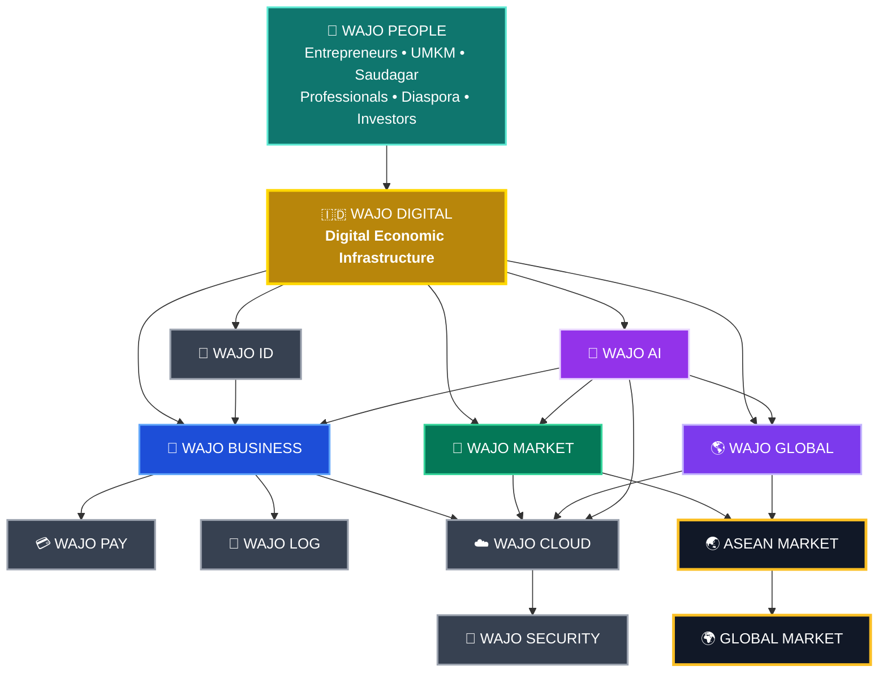

---

# 🧭 Core Philosophy

WAJO DIGITAL is inspired by positive values found in Bugis culture.

| Value | Digital Translation |
|---|---|
| **Sompe'** | Expansion & global mobility |
| **Siri'** | Reputation & accountability |
| **Lempu'** | Integrity & data trust |
| **Getteng** | Reliability & commitment |
| **Reso** | Execution & productivity |
| **Pesse** | Community & solidarity |
| **Acca** | Intelligence & innovation |
| **Sipakatau** | Human-centered technology |

> The objective is not to stereotype culture, but to translate positive cultural principles into modern technology.

---

# 🚀 Core Ecosystem

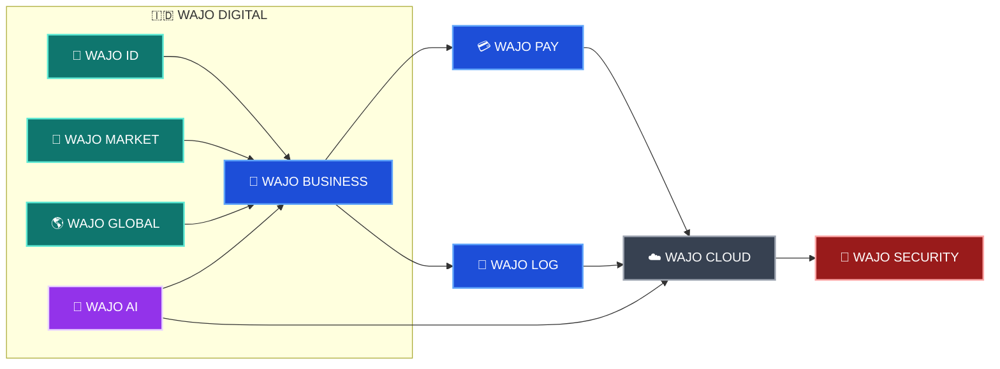

---

# 🪪 WAJO ID

A digital business identity layer for local entrepreneurs and organizations.

### Business Identity

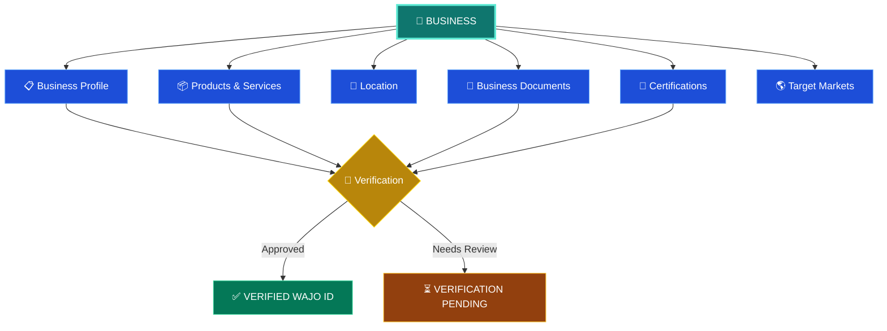

---

# 🛒 WAJO MARKET

A digital marketplace connecting Wajo producers with buyers.

### Product Categories

- 🧵 Silk & Textile
- 🌾 Agriculture
- 🐟 Fisheries
- 🍘 Food & Snacks
- 👕 Fashion
- 🪑 Crafts
- 🏪 Retail
- 🏭 Manufacturing
- 🧑‍💻 Digital Services
- 🚚 Logistics

### Market Expansion

---

# 🌎 WAJO GLOBAL NETWORK

A professional network connecting Wajo entrepreneurs and diaspora around the world.

### Network

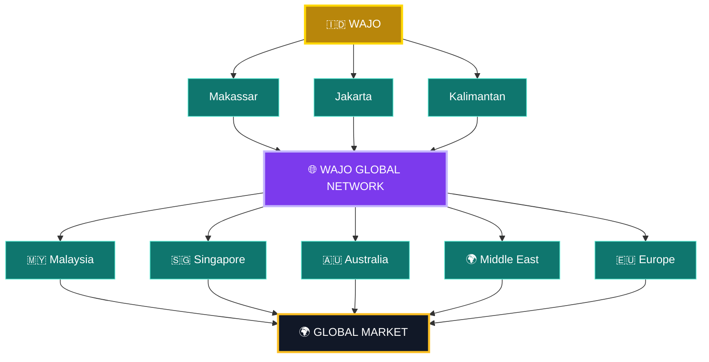

---

# 🤖 WAJO AI

AI-powered intelligence for businesses.

### AI Business Assistant

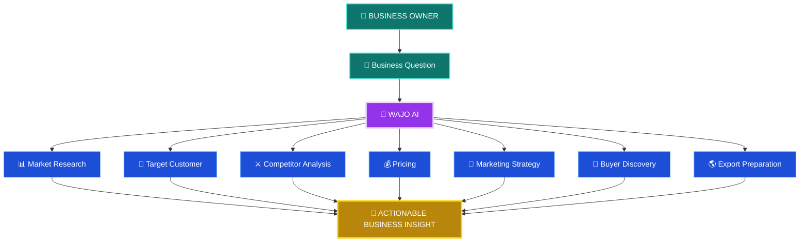

---

# 📊 WAJO BUSINESS OS

Digital tools for small and medium businesses.

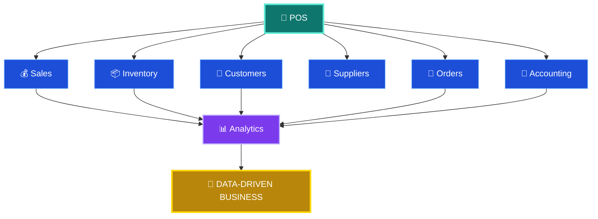

---

# 🌐 WAJO EXPORT HUB

---

# 🔐 WAJO SECURITY

> **Digital Siri' = Protecting trust, identity, data, and reputation.**

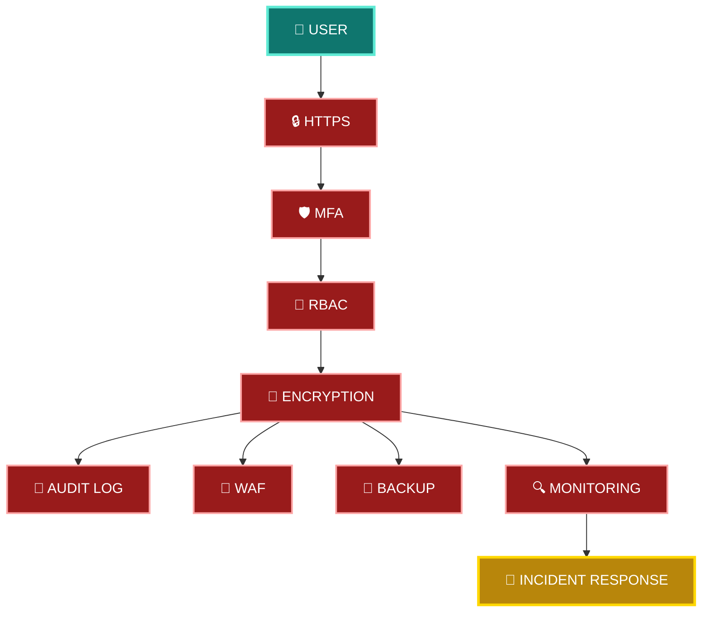

---

# 🏗️ Technology Architecture

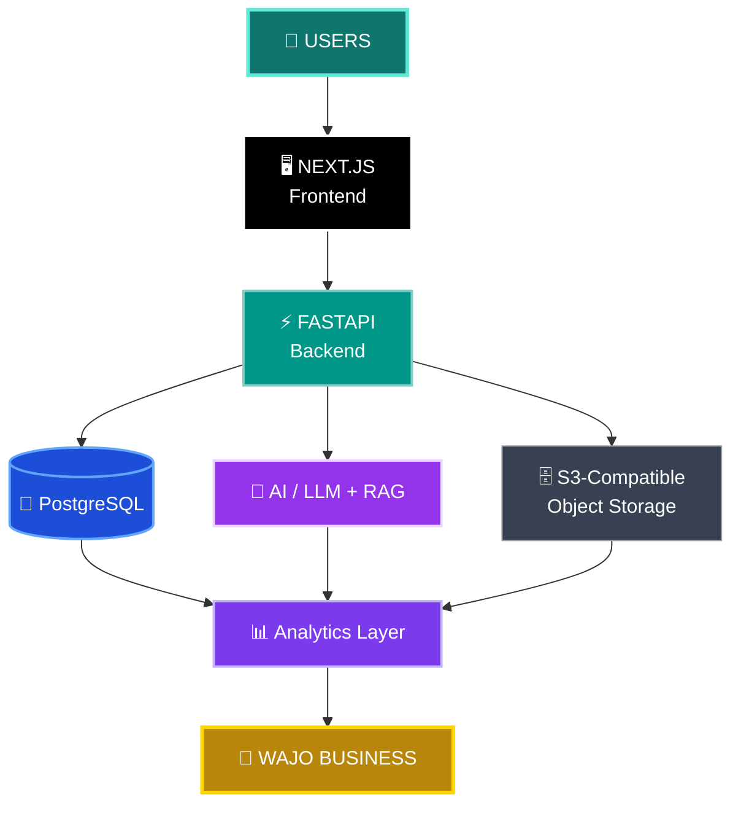

---

# 🗄️ Core Data Model

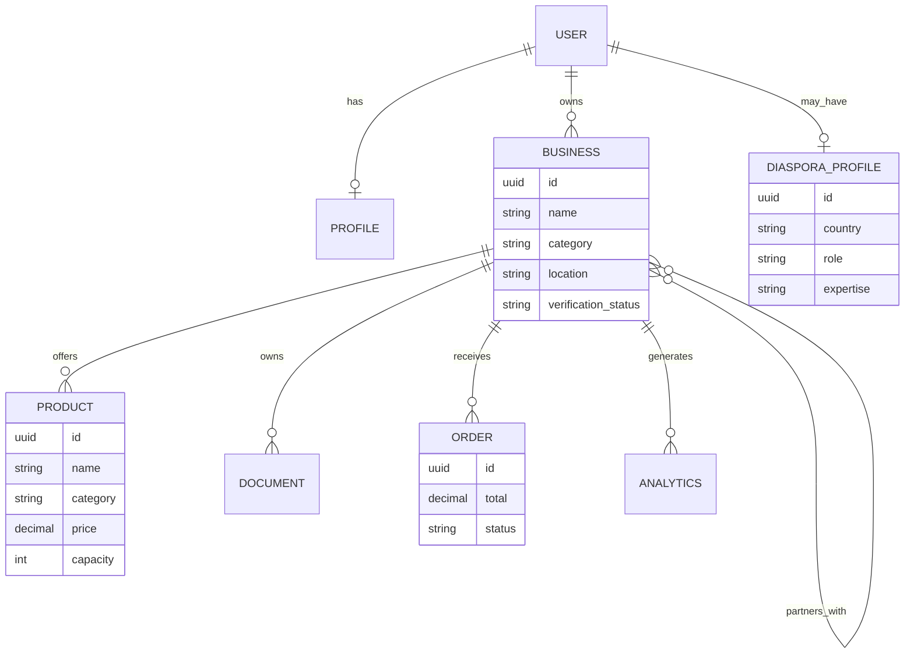

---

# 🛣️ Roadmap

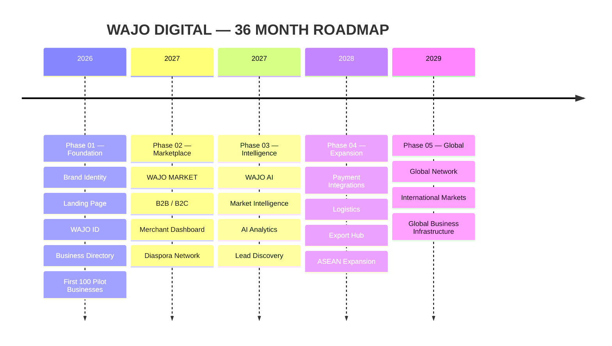

---

# 🎯 1,000 DIGITAL UMKM WAJO

### Key Metrics

- Registered businesses
- Verified businesses
- Active merchants
- Digital catalogs
- Transactions
- GMV
- New customers
- B2B connections
- Export leads
- Export transactions
- Jobs created
- Digital adoption rate

---

# 💼 Business Model

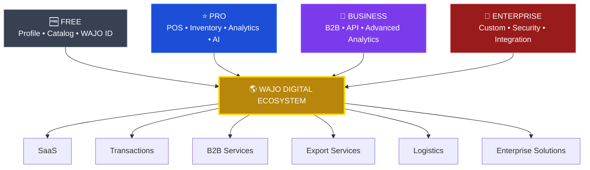

---

# 🤝 Ecosystem Partners

Potential ecosystem stakeholders:

- Pemerintah Kabupaten Wajo
- Dinas terkait
- BPS
- KADIN
- HIPMI
- Perguruan tinggi
- Perbankan
- Fintech
- Telekomunikasi
- Logistics providers
- UMKM
- Saudagar Wajo
- Diaspora Wajo
- Technology partners

---

# 🌱 Economic Impact

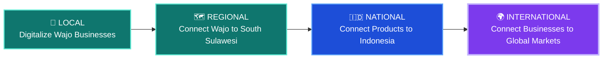

---

# 🔥 The Idea

## Dulu — **SOMPE'**

## Sekarang — **SOMPE' DIGITAL**

> **Dulu orangnya yang merantau.**  
> **Sekarang bisnisnya yang merantau secara digital.**

---

# 🧭 Our Principle

> **Jangan hanya membawa teknologi ke Wajo.**  
> **Bawa Wajo ke ekonomi digital dunia.**

---

# 🚀 Mission

**WAJO DIGITAL** is building the digital infrastructure that allows a business in **Sengkang** to discover a customer in **Jakarta**, a distributor in **Kuala Lumpur**, an investor in **Singapore**, and a global market — without losing its roots.

### **From Sengkang. Connected to the World.**

---

# 🇮🇩 WAJO DIGITAL

### **SOMPE' DIGITAL — DARI SENGKANG UNTUK DUNIA**

---

## 📜 License

This project is licensed under the **MIT License**.

See [`LICENSE`](LICENSE) for details.

---

## ⭐ Support

If you believe technology can help bring Wajo's businesses to the global market:

**Star ⭐ the repository and join the movement.**

# **SOMPE' DIGITAL**

### **Dari Sengkang untuk Dunia. 🇮🇩🌏**

# ☕ Support the Project

If this research has helped your work in:

- Financial infrastructure
- Cybersecurity
- FinTech
- Blockchain
- Gold-market research
- Digital assets
- Open-source development

consider supporting continued development.

  

---

<h2 align="center">🏦 BULLION BANK RESEARCH</h2>

  <b>Physical Gold → Allocated → Unallocated → OTC → Clearing → Settlement → Digital Gold</b>

  <b>Research • Financial Infrastructure • Bullion Markets • FinTech • Security</b>

  Built for open research and technical understanding of modern gold-market infrastructure.

